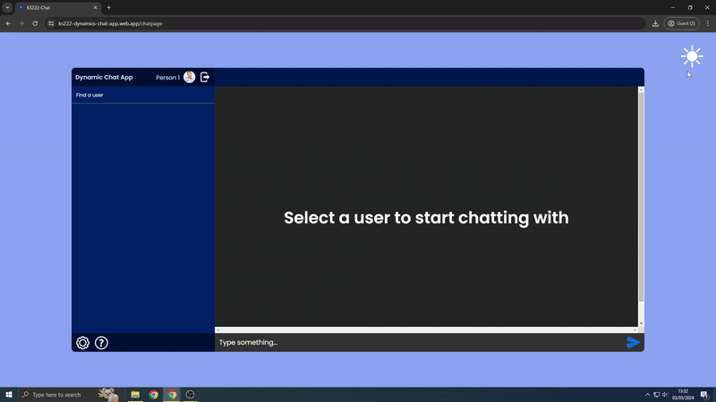

# KS222-Dynamics Chat App

A real-time, one-on-one chat application built with React, Firebase, and NodeJS. The app allows users to send text messages, emojis, and media, while offering advanced features like account management, profile customization, and protection against bots.

## Demo


You can view the live application here:

- [Dynamics Chat App (via Firebase Hosting)](https://ks222-dynamics-chat-app.web.app/)
- [Dynamics Chat App (via FirebaseApp)](https://ks222-dynamics-chat-app.firebaseapp.com/)

## Features

- **One-to-One Messaging**: Chat with other users individually.
- **Light/Dark Mode**: Toggle between light and dark themes.
- **Profile Customization**: Change your display name and profile picture.
- **Google reCAPTCHA**: Protects the app from bots.
- **Firebase Integration**: Authenticates users, stores data, and manages conversations.
- **Real-time Updates**: Use Firebase's Firestore for live message exchanges.
- **User Search**: Find and connect with other users.
- **Account Security**: Signup with Email/Password or Google, and change your credentials easily.

## Technologies Used

### React
React is a JavaScript library that uses components and states to build interactive user interfaces. It manages the display of various forms, user profiles, and chat data in the app.

### NodeJS
NodeJS handles the server-side logic of the app. It communicates with Firebase to manage user credentials, messages, and data flow between the frontend and backend.

### Firebase
- **Authentication**: Users can register, log in, and authenticate via Google or Email/Password.
- **Firestore**: Stores user data and chat messages.
- **Cloud Storage**: Allows users to upload and store their profile pictures.
- **Firebase Hosting**: Hosts the app and serves content via two different domain links for easy access.

## Setup & Installation

### Prerequisites
- Node.js installed on your machine.
- A Firebase project set up for authentication and hosting.

### Steps
1. Clone the repository:
    ```bash
    git clone https://github.com/yourusername/dynamics-chat-app.git
    cd dynamics-chat-app
    ```

2. Install dependencies:
    ```bash
    npm install
    ```

3. Set up Firebase:
    - Create a Firebase project at [https://console.firebase.google.com/](https://console.firebase.google.com/).
    - Enable Firebase Authentication (Email/Password & Google).
    - Set up Firestore and Cloud Storage.
    - Replace the Firebase config in your project with your Firebase credentials.

4. Start the development server:
    ```bash
    npm start
    ```

5. Navigate to `http://localhost:3000` in your browser to see the app in action.

### Running the app in production:
To deploy the app to Firebase Hosting:
```bash
firebase deploy
```

## Future Features

- **Message Encryption**: Secure the chat messages for privacy.
- **Friending System**: Users can add friends and create a social network.
- **Moderation System**: Admins can moderate messages for inappropriate content.
- **Send Media**: Share images, videos, and other media.
- **Group Chat**: Support for multiple users chatting in the same room.
- **Voice Chat**: Enable voice communication in real-time.
- **FAQ**: Add a frequently asked questions section to guide users.

